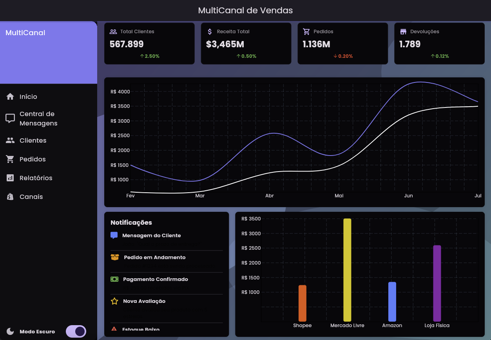
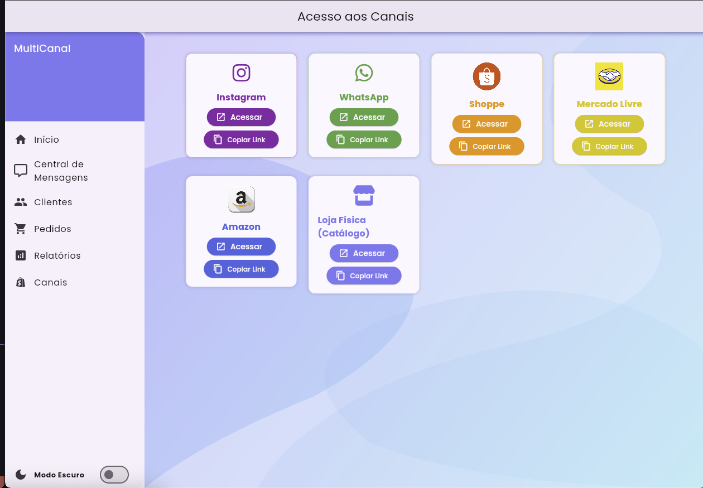
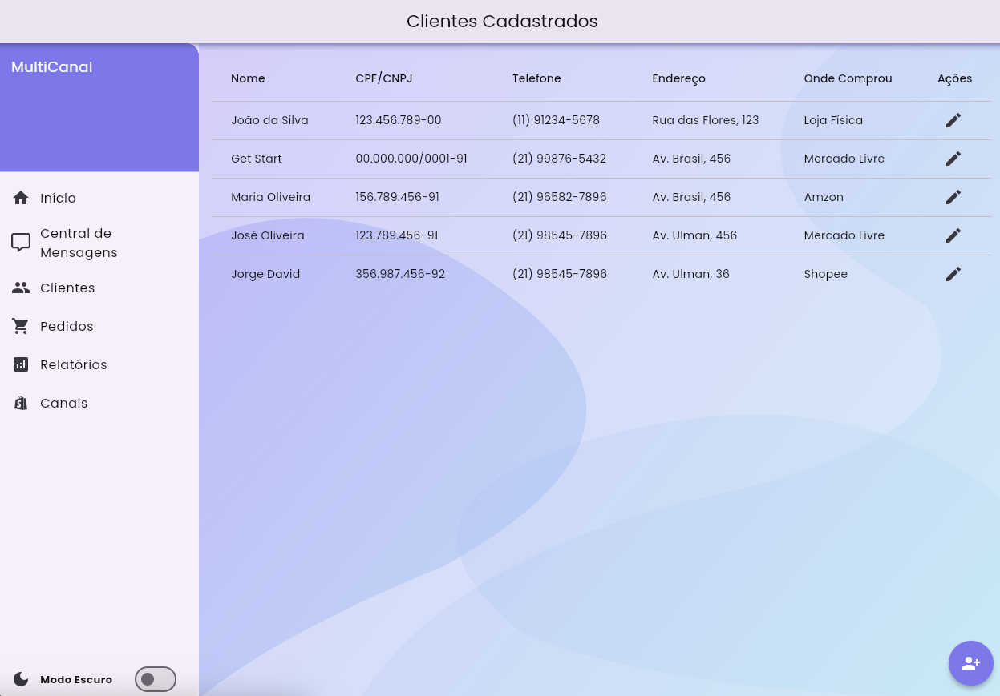
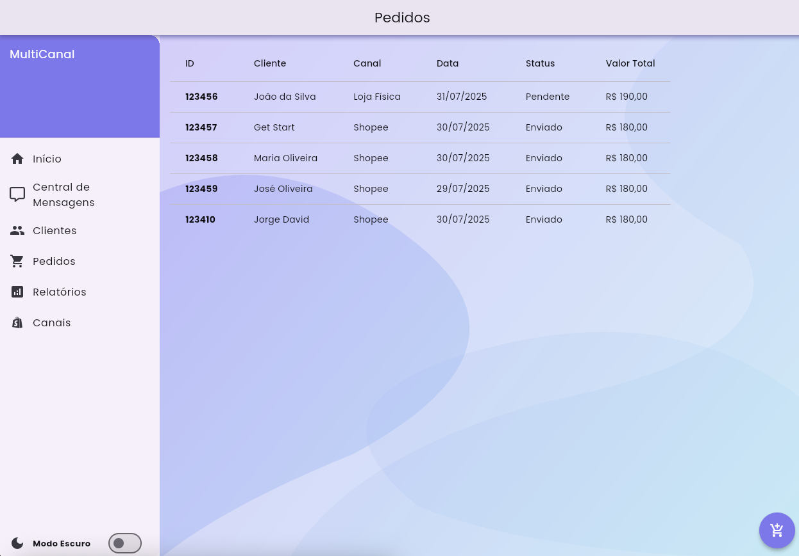
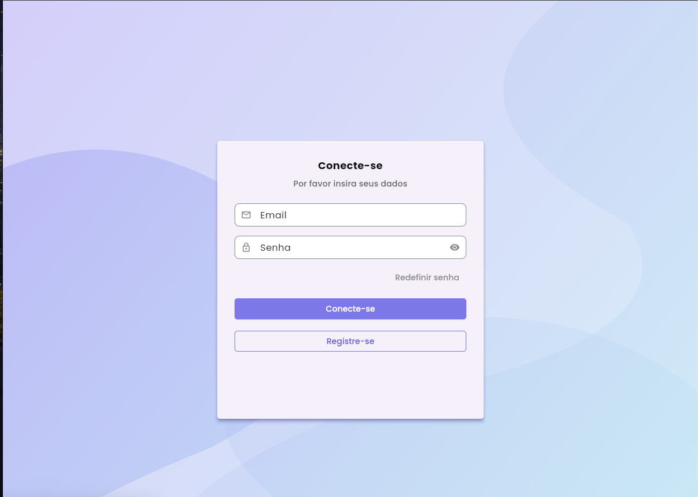
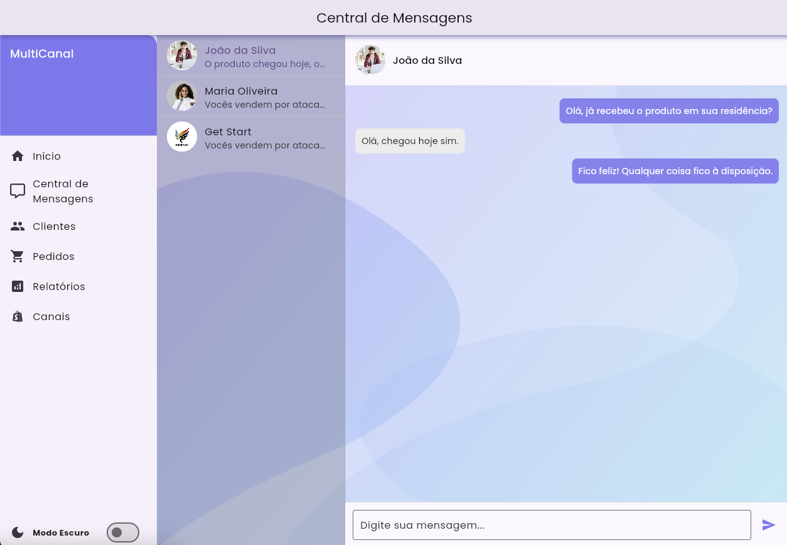
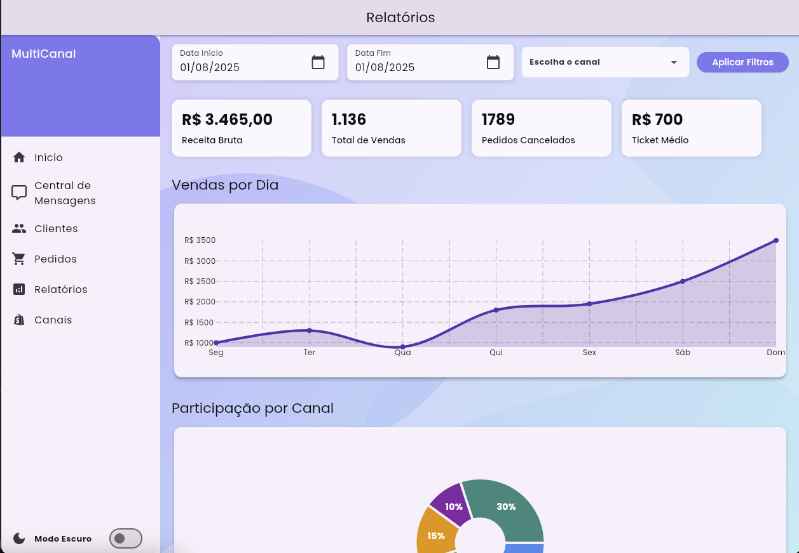

# multi_channel

Um painel administrativo moderno, responsivo e totalmente desenvolvido em Flutter Web, com controle de tema claro/escuro, gráficos animados e cards dinâmicos.

Projeto criado como parte do meu portfólio para demonstrar habilidades em Flutter, Provider, gerenciamento de tema, dashboards, e interfaces profissionais.

<p align="center">  </p> <p align="center">  </p>


## Funcionalidades

- Layout responsivo (Web-first)
- Animações suaves e componentes reutilizáveis
- Gráfico de linha, pizza e barras (usando fl_chart)
- Página para gerenciar os Clientes
- Página para gerenciar os Pedidos
- Relatório com Filtros de dias
- Todo relatório por canais
- Cards de relatórios por canal 
- Central de mensagens para com os clientes
- Controle de Dark Mode via Provider
- Estrutura modular com ThemeProvider
- Drawer com navegação lateral
- Código limpo e de fácil manutenção

<p align="center">  </p>
<p align="center">  </p>
<p align="center">  </p>
<p align="center">  </p>
<p align="center">  </p>
<p align="center">  </p>


## Como executar o projeto

1. Certifique-se de ter o Flutter instalado:
   ```bash
   flutter doctor
   ```

2. Clone este repositório:
   ```bash
   git clone https://github.com/marllondavid/multi_channel
   cd estetica_model
   ```

3. Instale as dependências:
   ```bash
   flutter pub get
   ```

4. Execute o app (web ou mobile):
   ```bash
   flutter run -d chrome
   # ou para Android/iOS
   flutter run
   ```

## Planejamento futuro
   
Este projeto está em constante evolução! Algumas funcionalidades planejadas incluem:
   
- Tabelas de relatórios mais detalhadas
- Exportação de dados (.csv/.pdf)
- Integração com APIs reais
- Controle de usuários e permissões

   
## Autor
   
Desenvolvido por **Marlon David**  
[LinkedIn](https://www.linkedin.com/in/marlon-david-30a32122b/)  
[email](mailto:marllondaavid@gmail.com)
[whatsapp](21969766390)

## 📄 Licença
   
Este projeto está sob a licença [MIT](LICENSE).